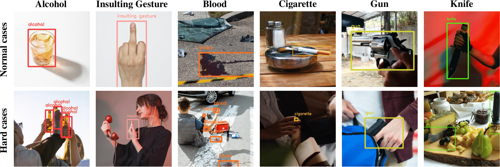
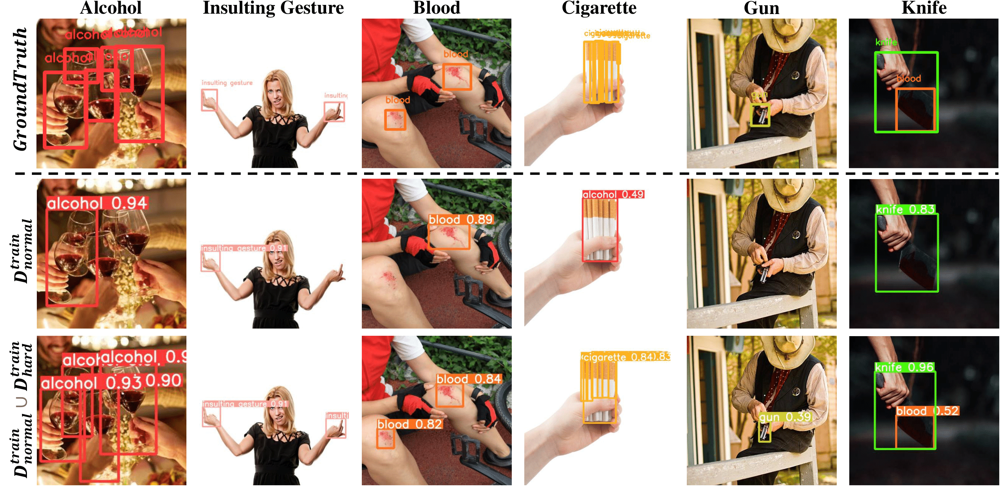
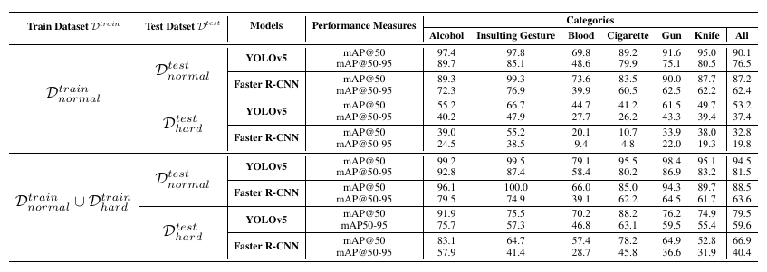

## HOD

### A Benchmark Dataset for Harmful Object Detection

* This repository provides <b>Harmful Object Dataset</b> and PyTorch implementations for Detection models(YOLOv5 and Faster-RCNN).

### Authors

* [Eungyeom Ha](https://github.com/poori-nuna), [Heemook Kim](https://github.com/2mook2), [Sungchul Hong](https://github.com/schong57), [Dongbin Na](https://github.com/ndb796)

### Abstract

> Recent multi-media data such as images and videos have been rapidly spread out on various online services such as social network services (SNS). With the explosive growth of online media services, the number of image content that may harm users is also growing exponentially. Thus, most recent online platforms such as Facebook and Instagram have adopted content filtering systems to prevent the prevalence of harmful content and reduce the possible risk of adverse effects on users. Unfortunately, computer vision research on detecting harmful content has not yet attracted attention enough. Users of each platform still manually click the report button to recognize patterns of harmful content they dislike when exposed to harmful content. However, the problem with manual reporting is that users are already exposed to harmful content. To address these issues, our research goal in this work is to develop automatic harmful object detection systems for online services. We present a new benchmark dataset for harmful object detection. Unlike most related studies focusing on a small subset of object categories, our dataset addresses various categories. Specifically, our proposed dataset contains more than 10,000 images across 6 categories that might be harmful, consisting of not only normal cases but also hard cases that are difficult to detect. Moreover, we have conducted extensive experiments to evaluate the effectiveness of our proposed dataset. We have utilized the recently proposed state-of-the-art(SOTA) object detection architectures and demonstrated our proposed dataset can be greatly useful for the real-time harmful object detection task.

### Datasets

* The dataset is divided into two distinct groups based on the difficulty of detection: the <b>Normal cases</b> and the <b>Hard cases</b>.

    

* This repository provides (1) normal cases training dataset, (2) hard cases training dataset, (3) normal cases test dataset, (4) hard cases test dataset.

    <pre><b>Dataset/</b>
        <b>normal_cases/</b>
            train/
            test/
        <b>hard_cases/</b>
            train/
            test/</pre>

* The normal case training dataset contains 5,198 images.
* The hard case training dataset contains 4,908 images.
* The normal case test dataset contains 270 images.
* The normal case training dataset contains 255 images.

### Source Codes

### Demonstration

* The example images from the hard case test dataset and the corresponding inference results based on the training dataset.

  

* The detection performance of trained models.

  
  
### Citation

If this work can be useful for your research, please cite our paper:
<pre>
    @misc{ha2023hod,
      title={HOD: A Benchmark Dataset for Harmful Object Detection}, 
      author={Eungyeom Ha and Heemook Kim and Sung Chul Hong and Dongbin Na},
      year={2023},
      eprint={2310.05192},
      archivePrefix={arXiv},
      primaryClass={cs.CV}
}
</pre>
